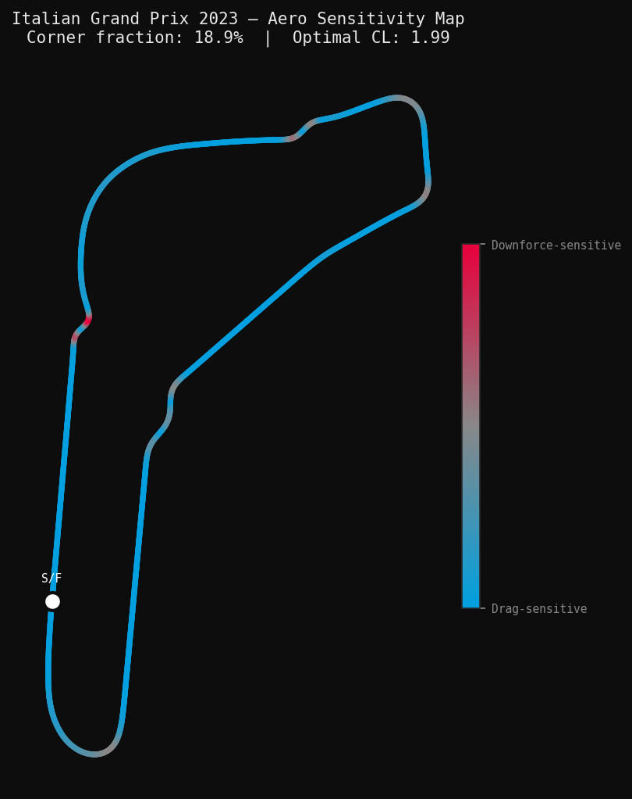
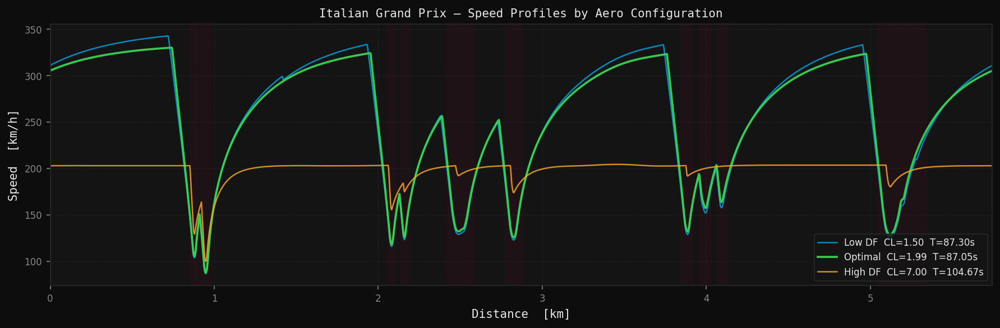
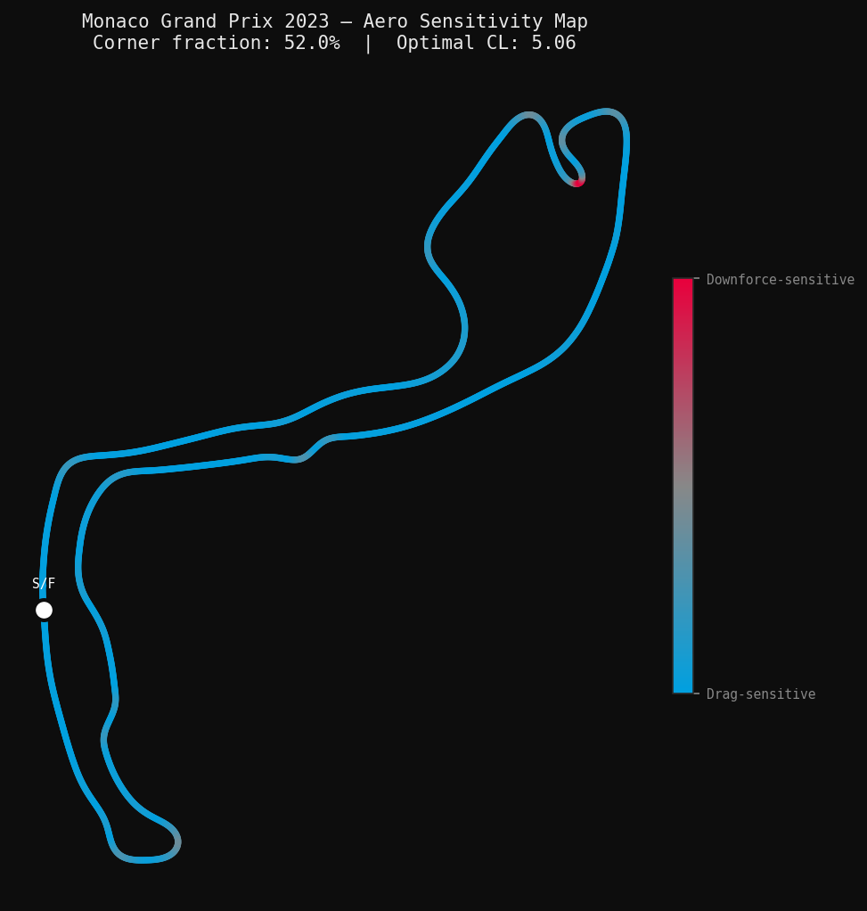
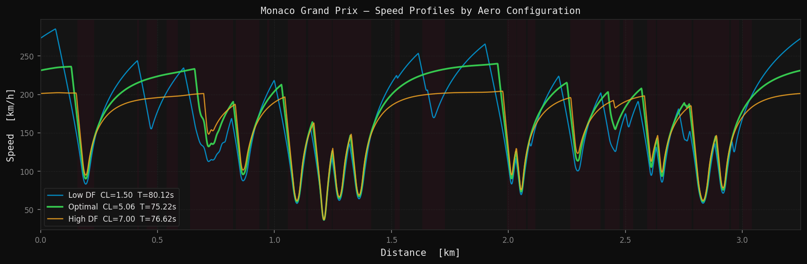
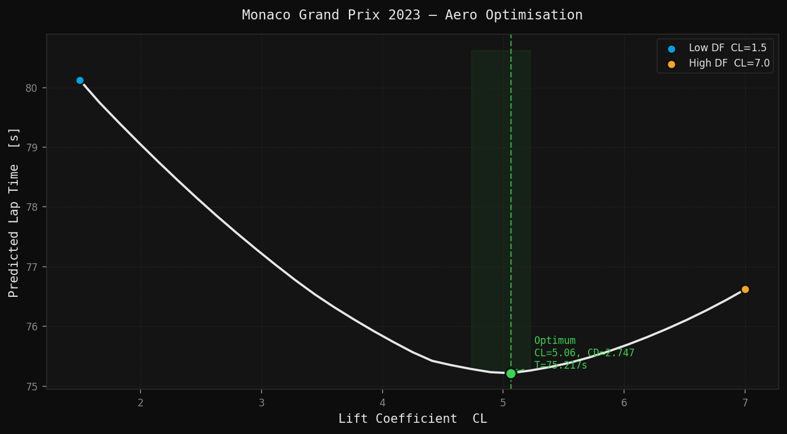
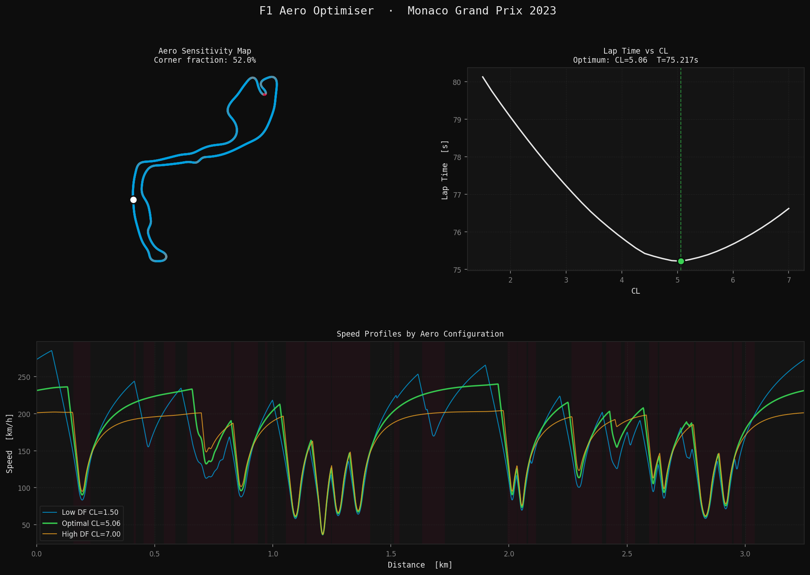

# F1 Aero Optimiser

A physics-based Python tool that finds the optimal aerodynamic configuration for a Formula 1 car on any circuit — using real telemetry data and a quasi-steady-state lap simulation engine.

---

## The Problem

Every Formula 1 circuit demands a different aerodynamic setup. More downforce helps the car corner faster, but the wings that generate it also create drag that limits top speed. Finding the right balance — specific to each circuit's geometry — is one of the most important setup decisions a race engineer makes.

This tool models that trade-off from first principles. Given a circuit, it finds the lift coefficient (CL) that minimises lap time, and quantifies how sensitive that result is to small changes in drag.

---

## How It Works

### 1. Circuit Geometry
Real GPS telemetry is pulled from [FastF1](https://github.com/theOehrly/Fast-F1) for the fastest qualifying lap. The coordinates are smoothed and differentiated twice to compute the local curvature κ(s) at every point — essentially how tightly the track is bending. High curvature means a tight corner. Near-zero curvature means a straight.

### 2. Vehicle Model
A point-mass car model captures the three forces that determine speed at any point:
- **Cornering limit** — lateral tyre grip, increased by aerodynamic downforce
- **Traction limit** — engine power vs tyre grip under acceleration
- **Braking limit** — tyre friction aided by aerodynamic drag

The aero model uses a standard drag polar: CD = CD₀ + k·CL², which captures the fundamental relationship that drag grows with the square of lift.

### 3. Lap Simulation
A quasi-steady-state (QSS) forward-backward integration computes the maximum achievable speed at every point around the circuit, then integrates to get the total lap time. This is the same class of model used in professional motorsport engineering for early-stage performance analysis.

### 4. Optimisation
The simulation runs across a sweep of CL values. The configuration that produces the minimum lap time is the optimum. A sensitivity metric quantifies how many milliseconds of lap time a 10-count drag change (ΔCD = 0.001) costs at that optimum.

---

## Results

The model correctly reproduces the known aero characteristics of contrasting circuits:

| Circuit | Corner Fraction | Optimal CL | Low→High DF Delta |
|---|---|---|---|
| Monza (Italian GP) | 18.9% | 1.99 | +17.4s |
| Monaco | 52.0% | 5.06 | -3.5s |

Monza's long straights push the optimum to minimum downforce. Monaco's near-constant cornering pushes it to maximum. The model recovers this result purely from circuit geometry and physics — no hardcoding.

---

## Output Figures

For each circuit the tool produces five figures:

- **Dashboard** — four-panel summary of all results
- **Lap time vs CL** — the optimisation curve with optimum annotated
- **Aero sensitivity map** — circuit coloured by drag vs downforce sensitivity
- **Speed profiles** — speed traces for low, optimal, and high downforce configs
- **Speed heatmap** — circuit coloured by speed at the optimal configuration

### Monza — Aero Sensitivity Map


### Monza — Speed Profiles


### Monza — Speed Heatmap


### Monza — Lap Time vs CL


### Monaco — Aero Sensitivity Map


### Monaco — Speed Profiles


### Monaco — Lap Time vs CL


### Monaco — Dashboard


---

## Installation

```bash
git clone https://github.com/yourusername/f1-aero-optimiser.git
cd f1-aero-optimiser
python -m venv venv
venv\Scripts\activate.bat        # Windows
source venv/bin/activate         # macOS/Linux
python -m pip install -r requirements.txt
```

---

## Usage

Single circuit:
```bash
python main.py --gp Italian --year 2023
```

Multiple circuits:
```bash
python main.py --gp Italian Monaco British --year 2023
```

All outputs are saved to `outputs/`. FastF1 session data is cached to `cache/` on first run — subsequent runs for the same circuit load instantly.

---

## Project Structure

```
f1-aero-optimiser/
├── main.py                  # CLI entry point
├── requirements.txt
├── config/
│   └── car_params.yaml      # Vehicle parameters
├── f1_aero/
│   ├── circuit.py           # GPS extraction & curvature computation
│   ├── vehicle.py           # Car model & aero physics
│   ├── simulation.py        # QSS lap simulation engine
│   ├── optimiser.py         # Aero sweep & sensitivity analysis
│   └── visualiser.py        # Figures
└── outputs/                 # Generated figures
```

---

## Dependencies

| Package | Purpose |
|---|---|
| `fastf1` | F1 session data and telemetry |
| `numpy` | Numerical computation |
| `scipy` | Signal filtering and interpolation |
| `matplotlib` | Visualisation |
| `pyyaml` | Config file parsing |

---

## Assumptions & Limitations

This is a simplified engineering model, not a full vehicle simulation. The following are deliberate simplifications:

- **Point-mass model** — no suspension, roll, or yaw dynamics
- **Constant tyre friction** — no thermal degradation or compound modelling
- **Simplified power unit** — constant peak power, no torque curve
- **Single aero polar** — no ground effect, ride height, or yaw sensitivity

These assumptions are consistent with early-stage race engineering practice. The model captures the dominant physics of the downforce/drag trade-off correctly, as validated by the Monza vs Monaco results above.

---

## Background

The quasi-steady-state lap simulation method has been used in professional motorsport engineering since the 1980s. Applying it to real circuit geometry extracted from FastF1 telemetry — and using it to frame the aero configuration trade-off quantitatively — is the contribution of this project.

Built as a portfolio project by an aeronautical engineering graduate from Imperial College London.
